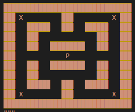

# Solver Pacman with RL

This was an old project to learn Reinforcement Learning and more preciasly Deep-Q Learning.

The objective was to remake PacMan the game and train an AI to be good at it.
The first part was a success.

Everything is detail in the PDF associated.

